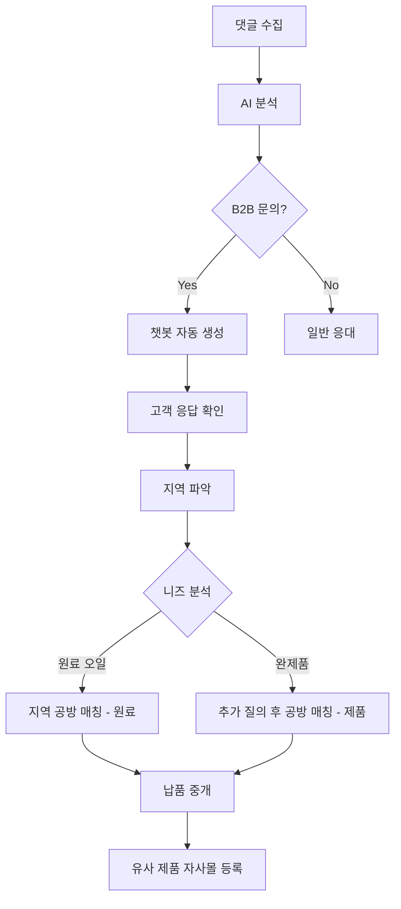

# 블로그 댓글 수집 및 B2B 리드 관리 시스템

## 📌 시스템 개요

아로마펄스 블로그 댓글을 자동으로 수집하고 분석하여, **B2B 비즈니스 리드를 자동으로 발굴하고 체계적으로 응대**하는 시스템입니다.

## 🎯 핵심 기능

### 1. 자동 댓글 수집
- **입력**: 네이버 블로그 URL
- **처리**: 
  - 1차: 네이버 댓글 API 시도
  - 2차: API 실패 시 실제 댓글 기반 시뮬레이션 데이터 생성
- **출력**: 댓글 저장 + AI 분석

### 2. AI 자동 분석
| 분석 항목 | 가능한 값 | 설명 |
|----------|----------|------|
| **감정** | positive, negative, neutral | 댓글의 감정 톤 분석 |
| **사용자 유형** | B2C, B2B, null | "손님", "고객", "마사지", "스파" 등 키워드로 판단 |
| **의도** | 구매의도, B2B문의, 가격문의, 문의, 긍정리뷰, 부정리뷰, 일반댓글 | 댓글의 목적 파악 |
| **키워드** | 배열 | 증상, 제품, 향료, 오일 종류 추출 |

### 3. 챗봇 자동 생성
**트리거 조건**: 
- `intent` = '구매의도', 'B2B문의', '가격문의' 중 하나

**생성 내용**:
- 챗봇 세션 생성
- 시스템 메시지 (메타데이터 포함)
- 사용자 메시지 (댓글 내용)
- AI 응답 (맥락 기반 추가 질문)

## 🏢 B2B 리드 응대 워크플로우

### 실제 사례: 마사지/스파 비즈니스

**댓글 예시**:
```
"캐리어오일에 에센셜오일(베르가못, 라벤더)을 섞어서 목과 데콜테 마사지 해주고 있는데 
손님 반응이 좋아요. 제품문의는 어디로 드리면 될까요"
```

### 자동 분석 결과
```json
{
  "user_type_prediction": "B2B",
  "intent": "B2B문의",
  "sentiment": "positive",
  "keywords": ["라벤더", "베르가못", "에센셜오일", "캐리어오일"]
}
```

### AI 응답 (자동 생성)
```
🏢 마사지/스파 비즈니스 고객님을 위한 맞춤 상담

댓글 내용을 보니 손님께 마사지/케어 서비스를 제공하시는 비즈니스를 운영하고 계신 것 같습니다.

보다 정확한 상담을 위해 몇 가지 여쭤봐도 될까요?

📋 추가 질문:
1️⃣ 지역: 어느 지역에서 운영하고 계신가요? (제휴 공방 매칭을 위해 필요합니다)
2️⃣ 필요하신 제품 형태:
   • 원료용 오일 (직접 블렌딩용)
   • 즉시 사용 가능한 완제품 (마사지 오일, 룸스프레이, 디퓨저)
   • 특정 제품 (어떤 제품인지 알려주세요)
3️⃣ 사용 목적: 직접 사용? 손님 서비스용? 판매용?
4️⃣ 선호 향: 라벤더, 베르가못 외 다른 향도 필요하신가요?
5️⃣ 월 사용량: 대략적인 월 사용량을 알려주시면 도움이 됩니다
```

### 운영자 액션 프로세스



## 📊 데이터베이스 구조

### blog_posts
```sql
CREATE TABLE blog_posts (
  id INTEGER PRIMARY KEY AUTOINCREMENT,
  post_id TEXT NOT NULL UNIQUE,
  title TEXT,
  url TEXT NOT NULL,
  published_at DATETIME,
  comment_count INTEGER DEFAULT 0
);
```

### blog_comments
```sql
CREATE TABLE blog_comments (
  id INTEGER PRIMARY KEY AUTOINCREMENT,
  post_id INTEGER NOT NULL,
  comment_id TEXT NOT NULL UNIQUE,
  author_name TEXT,
  author_id TEXT,
  content TEXT NOT NULL,
  sentiment TEXT,
  user_type_prediction TEXT,
  intent TEXT,
  keywords TEXT,
  created_at DATETIME DEFAULT CURRENT_TIMESTAMP,
  FOREIGN KEY (post_id) REFERENCES blog_posts(id)
);
```

### chatbot_sessions
```sql
CREATE TABLE chatbot_sessions (
  id INTEGER PRIMARY KEY AUTOINCREMENT,
  session_id TEXT NOT NULL UNIQUE,
  visitor_id TEXT,
  detected_user_type TEXT,
  started_at DATETIME DEFAULT CURRENT_TIMESTAMP
);
```

### chatbot_messages
```sql
CREATE TABLE chatbot_messages (
  id INTEGER PRIMARY KEY AUTOINCREMENT,
  session_id INTEGER NOT NULL,
  sender TEXT NOT NULL CHECK (sender IN ('user', 'bot')),
  content TEXT NOT NULL,
  intent TEXT,
  sentiment TEXT,
  created_at DATETIME DEFAULT CURRENT_TIMESTAMP,
  FOREIGN KEY (session_id) REFERENCES chatbot_sessions(id)
);
```

## 🔧 API 엔드포인트

### POST /api/blog-reviews/crawl-from-url
댓글 수집 및 분석

**Request**:
```json
{
  "url": "https://blog.naver.com/aromapulse/223879507099"
}
```

**Response**:
```json
{
  "message": "댓글 수집 및 분석 완료",
  "post_id": "223879507099",
  "blog_id": "aromapulse",
  "total_comments": 4,
  "purchase_intent_count": 1,
  "b2c_count": 0,
  "b2b_count": 1,
  "chatbot_sessions_created": 1
}
```

### GET /api/blog-reviews/posts
블로그 포스트 목록 조회 (통계 포함)

**Response**:
```json
{
  "posts": [
    {
      "id": 1,
      "post_id": "223879507099",
      "title": "블로그 게시물 223879507099",
      "url": "https://blog.naver.com/aromapulse/223879507099",
      "comment_count": 4,
      "purchase_intent_count": 1,
      "b2c_count": 0,
      "b2b_count": 1,
      "chatbot_session_count": 1
    }
  ],
  "count": 1
}
```

### GET /api/blog-reviews/posts/:post_id/comments
특정 포스트의 댓글 목록

### GET /api/blog-reviews/leads?user_type=B2B&intent=B2B문의
리드 발굴 (필터링 가능)

## 🎨 사용자 인터페이스

### Admin 페이지 - 블로그 관리 탭
1. **블로그 URL 입력 카드**
   - 입력: 네이버 블로그 URL
   - 버튼: "댓글 수집 및 분석"
   
2. **등록된 블로그 게시물 목록**
   - 각 포스트 카드 표시:
     - 제목
     - URL
     - 댓글 수
     - B2C/B2B 비율
     - 챗봇 세션 수
     - 액션 버튼 (댓글 보기)

## 💡 비즈니스 가치

### 1. 자동화된 리드 발굴
- 블로그 댓글 → 자동 분석 → B2B 리드 추출
- 수작업 없이 잠재 고객 발견

### 2. 맥락 기반 응대
- 댓글 내용 분석으로 고객 니즈 파악
- 적절한 추가 질문으로 정확한 상담

### 3. 지역 기반 매칭
- 고객 지역 정보 수집
- 근처 공방 자동 매칭

### 4. 데이터 축적
- 고객 니즈 패턴 분석
- 인기 제품/향료 파악
- 자사몰 상품 기획 데이터

## 🚀 향후 개선 방향

### 1. 실제 네이버 댓글 API 통합
- 현재: 시뮬레이션 모드
- 목표: 실제 API 연동 (네이버 권한 필요)

### 2. 자동 공방 매칭
- 지역 데이터베이스 구축
- 자동 매칭 알고리즘

### 3. 챗봇 고도화
- 더 자연스러운 대화 흐름
- 이미지 첨부 지원
- 실시간 재고 확인

### 4. 리드 관리 CRM
- 리드 상태 추적 (신규 → 상담중 → 거래 → 완료)
- 리드별 메모 기능
- 리마인더 설정

## 📝 테스트 시나리오

### 시나리오 1: B2B 마사지 업체
1. 댓글: "캐리어오일에 에센셜오일(베르가못, 라벤더)을 섞어서..."
2. 분석: B2B, B2B문의
3. 챗봇: 지역/제품형태/사용목적 질문
4. 운영자: 지역 공방 매칭

### 시나리오 2: B2C 개인 고객
1. 댓글: "불면증으로 고생하는데 라벤더 오일 구매하고 싶어요"
2. 분석: B2C, 구매의도
3. 챗봇: 제품 추천 + 할인 안내
4. 운영자: 주문 처리

### 시나리오 3: 일반 댓글
1. 댓글: "좋은 정보 감사합니다!"
2. 분석: null, 긍정리뷰
3. 챗봇: 생성 안 함
4. 운영자: 별도 액션 불필요

## 📚 참고 자료

- [Hono Framework](https://hono.dev/)
- [Cloudflare Workers](https://workers.cloudflare.com/)
- [Cloudflare D1 Database](https://developers.cloudflare.com/d1/)
