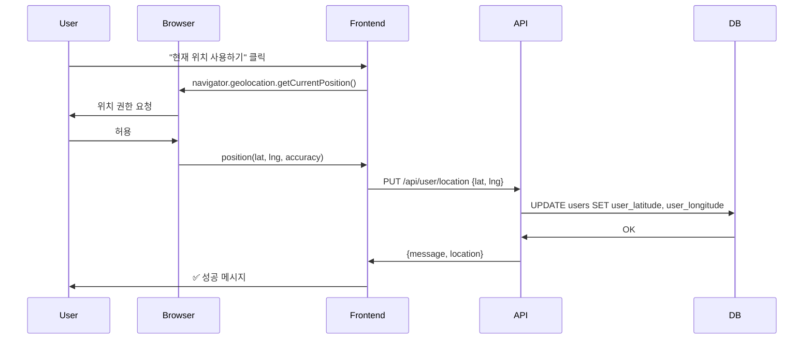

# Geolocation API 기능 구현 완료

## 📍 개요
브라우저의 Geolocation API를 사용하여 사용자가 위치 권한을 허용하면 현재 위치를 자동으로 감지하고, 인근 공방을 검색할 수 있는 기능을 추가했습니다.

## ✅ 구현된 기능

### 1. 서버 API - 위치 업데이트 엔드포인트
**파일: `/src/routes/user.ts`**
**엔드포인트: `PUT /api/user/location`**

#### 기능:
- 사용자의 현재 좌표(위도/경도)를 직접 업데이트
- JWT 토큰 기반 인증
- 좌표 유효성 검증
- DB에 `user_latitude`, `user_longitude` 저장

#### 요청 형식:
```json
PUT /api/user/location
Content-Type: application/json

{
  "latitude": 37.5665,
  "longitude": 126.9780
}
```

#### 응답 형식:
```json
{
  "message": "위치가 성공적으로 업데이트되었습니다",
  "location": {
    "latitude": 37.5665,
    "longitude": 126.9780
  }
}
```

#### 유효성 검증:
- **위도**: -90 ~ 90
- **경도**: -180 ~ 180
- 숫자 타입 필수

### 2. Mypage - 현재 위치 사용 버튼
**파일: `/public/static/mypage.html`, `/public/static/mypage.js`**

#### UI 변경사항:
```html
<!-- 주소 입력 필드 아래 추가됨 -->
<button type="button" onclick="useCurrentLocation()" 
        class="w-full flex items-center justify-center gap-2 px-4 py-2.5 bg-purple-50 text-purple-600 rounded-xl hover:bg-purple-100 transition text-sm font-medium">
    <i class="fas fa-location-crosshairs"></i>
    <span>현재 위치 사용하기</span>
</button>
<p class="text-xs text-gray-500">
    <i class="fas fa-info-circle mr-1"></i>
    현재 위치를 사용하면 인근 공방을 쉽게 찾을 수 있습니다
</p>
```

#### JavaScript 함수: `useCurrentLocation()`
**동작 흐름:**
1. Geolocation API 지원 확인
2. 버튼 로딩 상태로 변경
3. `navigator.geolocation.getCurrentPosition()` 호출
   - `enableHighAccuracy: true` - 고정밀도 모드
   - `timeout: 10000` - 10초 타임아웃
   - `maximumAge: 0` - 캐시 사용 안 함
4. 위치 획득 성공 시:
   - `/api/user/location`에 좌표 전송
   - 주소 필드에 좌표 표시
   - 성공 메시지 (정확도 포함)
5. 위치 획득 실패 시:
   - 에러 타입별 메시지 표시
   - 권한 거부/타임아웃/위치 불가 구분

#### 에러 메시지:
- **PERMISSION_DENIED**: "위치 권한이 거부되었습니다. 브라우저 설정에서 위치 권한을 허용해주세요."
- **POSITION_UNAVAILABLE**: "위치 정보를 사용할 수 없습니다."
- **TIMEOUT**: "위치 요청 시간이 초과되었습니다. 다시 시도해주세요."

### 3. Healing Page - 내 위치로 검색 버튼
**파일: `/public/static/healing.html`**

#### UI 변경사항:
```html
<!-- Section Header에 버튼 추가 -->
<button onclick="useCurrentLocationForMap()" 
        class="bg-white text-purple-600 px-6 py-3 rounded-xl font-semibold hover:bg-purple-50 transition flex items-center gap-2 shadow-lg">
    <i class="fas fa-location-crosshairs"></i>
    <span>내 위치로 검색</span>
</button>
```

#### JavaScript 함수:
1. **`useCurrentLocationForMap()`** - 현재 위치 획득 및 저장
   - Geolocation API로 좌표 획득
   - `/api/user/location`에 좌표 저장
   - `loadNearbyClasses()` 호출

2. **`loadNearbyClasses(latitude, longitude)`** - 인근 공방 검색
   - `GET /api/oneday-classes?nearby=true&maxDistance=50&provider=...`
   - 50km 이내 공방만 필터링
   - 지도 및 리스트 다시 렌더링
   - 발견된 공방 개수 표시

#### 사용자 경험:
1. "내 위치로 검색" 버튼 클릭
2. 브라우저에서 위치 권한 요청
3. 허용 시:
   - ✅ "현재 위치가 저장되었습니다!"
   - 🔍 "인근 공방을 검색합니다..."
   - ✅ "N개의 인근 공방을 찾았습니다!"
4. 거부 시:
   - ❌ 권한 거부 안내 메시지

## 🎯 사용 시나리오

### 시나리오 1: 신규 사용자 (주소 미입력)
1. 회원가입 후 마이페이지 접속
2. "현재 위치 사용하기" 버튼 클릭
3. 브라우저 권한 요청 → 허용
4. 자동으로 좌표 저장
5. 힐링 체험 페이지에서 인근 공방 자동 표시

### 시나리오 2: 기존 사용자 (이동 후)
1. 다른 지역으로 이동
2. 힐링 체험 페이지 접속
3. "내 위치로 검색" 버튼 클릭
4. 현재 위치 기준 인근 공방 재검색
5. 50km 이내 공방 목록 업데이트

### 시나리오 3: 모바일 사용자
1. 스마트폰으로 접속
2. GPS 기반 고정밀도 위치 감지
3. 실시간 위치로 가장 가까운 공방 찾기
4. 지도에서 경로 확인 가능

## 📱 브라우저 호환성

### 지원 브라우저:
- ✅ Chrome 5+
- ✅ Firefox 3.5+
- ✅ Safari 5+
- ✅ Edge 12+
- ✅ iOS Safari 3.2+
- ✅ Android Browser 2.1+

### 주의사항:
- **HTTPS 필수**: Geolocation API는 보안 컨텍스트(HTTPS)에서만 작동
- **권한 필요**: 사용자가 위치 권한을 허용해야 함
- **정확도 변동**: GPS, Wi-Fi, IP 기반으로 정확도가 다름
  - GPS (모바일): 5-10m
  - Wi-Fi: 20-100m
  - IP 기반: 수 km

## 🔒 보안 고려사항

### 1. 권한 관리
- 브라우저가 권한 요청 처리
- 사이트별로 권한 저장
- 사용자가 언제든지 취소 가능

### 2. 데이터 보호
- JWT 토큰 기반 인증
- 좌표 데이터만 저장 (주소 변환 안 함)
- 서버 측 유효성 검증

### 3. 프라이버시
- 사용자 동의 후에만 위치 수집
- 위치 정보는 공방 검색 목적으로만 사용
- 제3자와 공유 안 함

## 🧪 테스트 방법

### 로컬 테스트 (HTTPS 필요):
```bash
# localhost는 HTTPS 없이도 Geolocation 허용됨
pm2 start ecosystem.config.cjs
curl http://localhost:3000
```

### 프로덕션 테스트:
```bash
# HTTPS 환경에서만 작동
https://23e18a97.aromapulse.pages.dev/mypage
```

### 수동 테스트 절차:
1. **권한 허용 테스트**:
   - 마이페이지 접속
   - "현재 위치 사용하기" 클릭
   - 브라우저 권한 대화상자에서 "허용" 클릭
   - 성공 메시지 확인
   - 주소 필드에 좌표 표시 확인

2. **권한 거부 테스트**:
   - "현재 위치 사용하기" 클릭
   - 권한 대화상자에서 "차단" 클릭
   - 에러 메시지 확인

3. **인근 검색 테스트**:
   - 힐링 체험 페이지 접속
   - "내 위치로 검색" 클릭
   - 권한 허용
   - 인근 공방 로딩 확인
   - 거리순 정렬 확인

## 📊 API 호출 흐름



## 🚀 배포 정보

### 최종 배포:
- **Production URL**: https://23e18a97.aromapulse.pages.dev
- **GitHub Commit**: `470230f`
- **배포 시간**: 2025-11-25
- **변경된 파일**:
  - `/src/routes/user.ts` - PUT /api/user/location 추가
  - `/public/static/mypage.html` - 버튼 UI 추가
  - `/public/static/mypage.js` - useCurrentLocation() 추가
  - `/public/static/healing.html` - 검색 버튼 및 함수 추가

## 💡 향후 개선 사항

### 1. 위치 업데이트 최적화
- [ ] 위치 변경 감지 (watchPosition API)
- [ ] 백그라운드 위치 업데이트
- [ ] 배터리 사용량 최적화

### 2. 사용자 경험 개선
- [ ] 지도에 현재 위치 마커 표시
- [ ] 현재 위치와 공방 간 경로 표시
- [ ] 거리 정보를 사람이 읽기 쉽게 표시 ("2.3km" → "도보 30분")

### 3. 정확도 개선
- [ ] IP 기반 대략적 위치 → GPS 기반 정확한 위치로 업그레이드
- [ ] Wi-Fi/셀룰러 네트워크 정보 활용
- [ ] 위치 정확도에 따른 검색 반경 자동 조정

### 4. 캐싱 및 성능
- [ ] 최근 위치 캐싱 (1시간)
- [ ] 불필요한 위치 요청 방지
- [ ] 서버 부하 감소

## 📚 관련 문서
- **LOCATION_FEATURES_PHASE1.md** - 위치 기반 기능 Phase 1
- **LOCATION_FEATURES_PHASE2_COMPLETE.md** - Phase 2 완료 보고서
- **MDN Web Docs**: [Geolocation API](https://developer.mozilla.org/en-US/docs/Web/API/Geolocation_API)

## ⚠️ 알려진 제한사항

1. **HTTPS 필수**: localhost 외에는 HTTPS 환경에서만 작동
2. **권한 필요**: 사용자가 거부하면 기능 사용 불가
3. **정확도 변동**: 환경에 따라 정확도 차이 큼
4. **배터리 소모**: 고정밀도 모드는 배터리 소모량 증가
5. **실내 위치**: GPS 신호가 약한 실내에서는 정확도 낮음

## ✅ 완료 체크리스트

- [x] PUT /api/user/location 엔드포인트 구현
- [x] 좌표 유효성 검증 (위도/경도 범위)
- [x] mypage.html UI 추가
- [x] mypage.js useCurrentLocation() 함수
- [x] healing.html 검색 버튼 추가
- [x] healing.html useCurrentLocationForMap() 함수
- [x] healing.html loadNearbyClasses() 함수
- [x] 에러 처리 (권한 거부, 타임아웃, 불가)
- [x] 로딩 상태 UI
- [x] 성공/실패 메시지
- [x] 빌드 및 배포
- [x] 문서화
