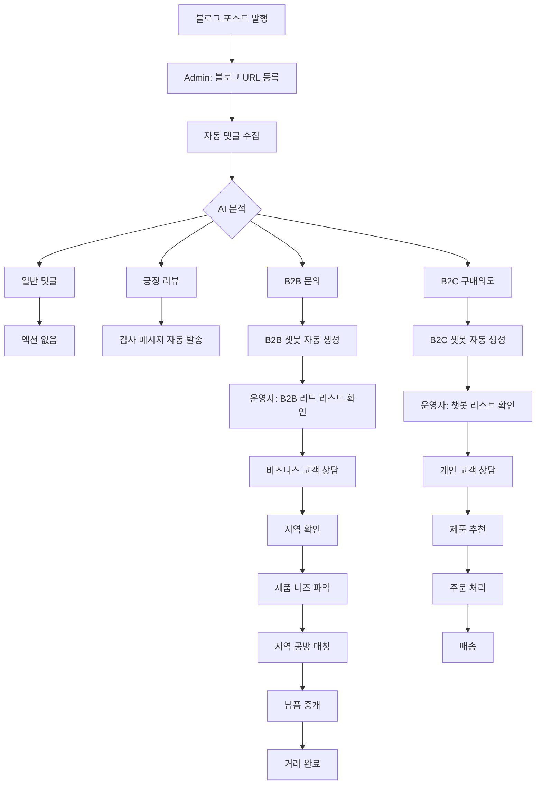

# 블로그 댓글 수집 → B2B 리드 관리 운영 워크플로우

## 📊 전체 프로세스 맵



## 1️⃣ 블로그 댓글 수집 (자동)

### 운영자 액션
1. Admin 페이지 접속: `/admin-products`
2. "블로그 관리" 탭 클릭
3. 네이버 블로그 URL 입력
4. "댓글 수집 및 분석" 버튼 클릭

### 시스템 자동 처리
- ✅ 댓글 크롤링 (또는 시뮬레이션 데이터 생성)
- ✅ AI 분석 (감정, 의도, 사용자 유형, 키워드)
- ✅ 데이터베이스 저장
- ✅ 통계 집계

### 결과 확인
```
댓글 수집 완료!

- 총 댓글: 4개
- 구매 의도: 1개
- B2C: 0개
- B2B: 1개
- 생성된 챗봇 세션: 1개
```

---

## 2️⃣ 챗봇 자동 생성 (자동)

### 트리거 조건
다음 의도 중 하나가 감지되면 자동 생성:
- `구매의도` (예: "구매하고 싶어요", "주문하려면?")
- `B2B문의` (예: "납품 가능한가요?", "제품문의 어디로?")
- `가격문의` (예: "가격이 얼마인가요?")

### 자동 생성 내용
1. **챗봇 세션** 생성
2. **3개 메시지** 자동 저장:
   - 시스템 메시지 (메타데이터)
   - 사용자 메시지 (댓글 내용)
   - AI 초기 응답 (추가 질문)

### 예시: B2B 문의 챗봇
```
[Bot] 🏢 마사지/스파 비즈니스 고객님을 위한 맞춤 상담

보다 정확한 상담을 위해 몇 가지 여쭤봐도 될까요?

📋 추가 질문:
1️⃣ 지역: 어느 지역에서 운영하고 계신가요?
2️⃣ 필요하신 제품 형태:
   • 원료용 오일 (직접 블렌딩용)
   • 즉시 사용 가능한 완제품
3️⃣ 사용 목적: 직접 사용? 손님 서비스용? 판매용?
4️⃣ 선호 향: 라벤더, 베르가못 외 다른 향도?
5️⃣ 월 사용량: 대략적인 사용량
```

---

## 3️⃣ 운영자 리드 확인 (수동)

### 액션 1: 챗봇 리스트 확인

**현재 구현 상태**: ⚠️ **개선 필요**

#### 현재 방법 (불편함)
```
1. 챗봇 페이지 접속: /chatbot
2. 모든 세션 수동 확인
3. B2B 태그 찾기
4. 하나씩 클릭해서 내용 확인
```

#### 개선 필요 사항
→ **"B2B 리드 관리" 전용 페이지 필요**

---

### 액션 2: B2B 리드 상세 확인

**필요한 정보**:
- ✅ 작성자 이름
- ✅ 댓글 내용
- ✅ 감지된 키워드 (오일 종류, 제품 등)
- ⚠️ 연락처 (현재 없음 → **개선 필요**)
- ⚠️ 지역 정보 (현재 없음 → **개선 필요**)
- ✅ 챗봇 대화 내역

---

## 4️⃣ 고객 응대 및 상담 (수동)

### B2B 고객 상담 프로세스

#### Step 1: 고객 응답 대기
챗봇이 자동 생성한 질문에 고객이 답변할 때까지 대기

**고객 응답 예시**:
```
[Customer] 
저희는 서울 강남구에서 스파를 운영하고 있어요.
원료용 오일이 필요한데, 라벤더와 베르가못 위주로 
월 500ml 정도 사용합니다. 직접 블렌딩해서 쓰려고요.
```

#### Step 2: 정보 정리
운영자가 수집한 정보:
- ✅ 지역: 서울 강남구
- ✅ 비즈니스 유형: 스파
- ✅ 제품 니즈: 원료용 오일 (라벤더, 베르가못)
- ✅ 사용 목적: 손님 서비스용 (직접 블렌딩)
- ✅ 월 사용량: 500ml

#### Step 3: 공방 매칭
**현재 상태**: ⚠️ **미구현**

**필요한 기능**:
1. 지역별 공방 데이터베이스
2. 공방별 취급 제품 정보
3. 자동 매칭 알고리즘

**임시 운영 방법**:
- 수동으로 지역 공방 검색
- 전화/이메일로 공방 연락
- 고객과 공방 연결

#### Step 4: 견적 및 거래
1. 공방에서 견적 받기
2. 고객에게 견적 전달
3. 거래 성사 시 수수료 협의

---

## 5️⃣ 현재 시스템의 한계와 개선 방향

### ⚠️ 현재 문제점

#### 1. 리드 관리 화면 부재
**문제**: 
- B2B 리드를 챗봇 페이지에서 수동으로 찾아야 함
- 우선순위 파악 어려움
- 응답 대기 중인 고객 놓칠 수 있음

**해결책**: 
→ **"B2B 리드 관리" 전용 페이지 개발** (다음 단계)

---

#### 2. 연락처 정보 없음
**문제**: 
- 블로그 댓글에는 연락처 없음
- 고객이 챗봇에서 응답할 때까지 기다려야 함

**해결책**:
- 챗봇 초기 응답에 "연락처 남기기" 버튼 추가
- 또는 블로그 댓글에 직접 답글로 연락 유도

---

#### 3. 공방 매칭 시스템 없음
**문제**: 
- 수동으로 공방 찾아야 함
- 시간 소요 크고 비효율적

**해결책**:
- 공방 데이터베이스 구축
- 지역/제품별 자동 매칭

---

#### 4. 거래 추적 기능 없음
**문제**: 
- 어떤 리드가 거래로 전환되었는지 추적 불가
- ROI 측정 어려움

**해결책**:
- 리드 상태 관리 (신규 → 상담중 → 거래 → 완료)
- 매출 추적 기능

---

## 🚀 다음 단계: 즉시 개선 가능한 항목

### Phase 1: B2B 리드 관리 페이지 (우선순위 1)

**새로운 페이지**: `/admin/b2b-leads`

**기능**:
```
┌─────────────────────────────────────────┐
│ B2B 리드 관리                            │
├─────────────────────────────────────────┤
│ 필터: [전체] [신규] [응답대기] [상담중]   │
├─────────────────────────────────────────┤
│                                          │
│ [카드 1]                                 │
│ 👤 여행에 힐링을 더하다                   │
│ 📍 지역: 미확인                           │
│ 💬 "캐리어오일에 에센셜오일..."           │
│ 🏷️ 키워드: 라벤더, 베르가못, 마사지       │
│ ⏰ 2시간 전                               │
│ 🔔 응답 대기중                            │
│ [챗봇 보기] [메모 추가]                   │
│                                          │
│ [카드 2]                                 │
│ ...                                      │
└─────────────────────────────────────────┘
```

---

### Phase 2: 챗봇 연락처 수집 (우선순위 2)

**챗봇 초기 응답 개선**:
```
[Bot] 🏢 비즈니스 문의 감사합니다!

빠른 상담을 위해 연락처를 남겨주시겠어요?

[전화번호 입력]
[이메일 입력]

또는 아래 질문에 답변해주세요:
1️⃣ 지역: ...
```

---

### Phase 3: 실시간 알림 (우선순위 3)

**새 리드 발생 시**:
- 이메일 알림
- Admin 페이지 알림 배지
- 카카오톡 알림 (선택)

---

## 📝 운영자 체크리스트

### 매일 해야 할 일
- [ ] 블로그 새 포스트 있는지 확인
- [ ] 새 포스트 URL 등록 및 댓글 수집
- [ ] B2B 리드 리스트 확인
- [ ] 응답 대기 중인 고객에게 답변
- [ ] 거래 진행 상황 업데이트

### 매주 해야 할 일
- [ ] 전환율 분석 (댓글 → 리드 → 거래)
- [ ] 키워드 트렌드 분석
- [ ] 챗봇 응답 개선 (필요 시)

### 매월 해야 할 일
- [ ] 공방 파트너십 점검
- [ ] 자사몰 상품 업데이트
- [ ] 시스템 개선 사항 검토

---

## 💡 실제 운영 팁

### 1. 빠른 응대가 핵심
- B2B 문의는 24시간 내 응답 권장
- 늦어도 48시간 내 1차 답변

### 2. 표준 응답 템플릿 준비
```
안녕하세요, 아로마펄스입니다.

{지역}에서 {비즈니스 유형}을 운영하신다고 하셨는데,
{제품 종류} 관련해서 도움을 드릴 수 있을 것 같습니다.

현재 {지역} 근처 공방과 연결해드릴 수 있으며,
{예상 가격대}로 공급 가능합니다.

더 자세한 상담을 위해 통화 가능하신 시간을 알려주시겠어요?
```

### 3. 공방 연락처 미리 정리
- 지역별 엑셀 시트 준비
- 공방별 특화 제품 메모
- 연락 가능 시간대 기록

---

## 🎯 성공 지표 (KPI)

### 단기 목표 (1개월)
- 댓글 수집: 100개 이상
- B2B 리드 발굴: 10개 이상
- 거래 전환: 2건 이상

### 중기 목표 (3개월)
- 댓글 수집: 500개 이상
- B2B 리드 발굴: 50개 이상
- 거래 전환: 10건 이상
- 전환율: 20% 이상

### 장기 목표 (6개월)
- 자동화율 80% 이상
- 평균 응답 시간 6시간 이내
- 월 매출 기여도 측정 가능
